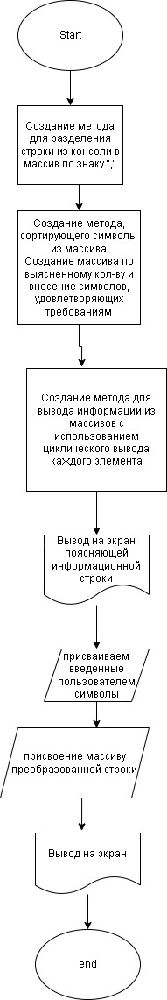

## Задание

Задача: Написать программу, которая из имеющегося массива строк формирует новый массив из строк, длина которых меньше, либо равна 3 символам. Первоначальный массив можно ввести с клавиатуры, либо задать на старте выполнения алгоритма. При решении не рекомендуется пользоваться коллекциями, лучше обойтись исключительно массивами.

## Решение

* Создание метода string[] GetArrayStringConsole

создаем метод для разделения строки из консоли в массив по знаку “,”

string[] GetArrayStringConsole (string inSimvol)
{
    string[] arraySimvol = new string[inSimvol.Length];
    arraySimvol = inSimvol.Split(",");
    return arraySimvol;
}
* Создание метода string[] GetArray3Simvol

создаем метод сортирующий символы из массива. сначала отсчитываем количество, удовлетворяющих требований, для определения длинны нового массива. создаем массив по выясненому количествуи заносим туда символы удовлетворяющие требованиям.

string[] GetArray3Simvol (string[] array)
{
    int count = 0;
    for (int i = 0; i < array.Length; i++)
    {
        string simvol = array[i];
        if (simvol.Length <= 3)
        {
            count++;
        }
    }
    string[] array3Simvol = new string[count];
    for (int i = 0, j = 0; i < array.Length; i++)
    {
        string simvol = array[i];
        if (simvol.Length <= 3)
        {
            array3Simvol[j] = simvol;
            j++;
        }
    }
    return array3Simvol;
}
* Создание метода void Print

создаем метод для вывода информации из массивов с использованием цеклического вывода каждого элемента массива.

void Print (string[] array)
{
    for (int i = 0; i < array.Length; i++)
    {
        Console.Write($"{array[i]}, ");
    }
    Console.WriteLine();
}
* Создаем "клентский код" для вызова методов и обработки информации через консоль.
выводим поясняющую информационную строку для пользователя в консоле: "Введите набор символов через знак (,) - ""Введите набор символов через знак (,) - "

присваиваем введенное в консоле от пользователя символы string inStringSimvol = console.ReadLine()
присваиваем массиву преобразованную строку через метод string[] arraySimvol = GetArrayStringConsole(inStringSimvol)
Console.WriteLine(); Console.Write("Введенные символы - "); Print(GetArrayStringConsole(inStringSimvol)); Console.WriteLine(); Console.Write("Введенные символы длинной меньше либо равны 3 - "); Print(GetArray3Simvol(arraySimvol)); Console.WriteLine();

Console.Write("Введите набор символов через знак (,) - ");
string inStringSimvol = Console.ReadLine();
string[] arraySimvol = GetArrayStringConsole(inStringSimvol);
Console.WriteLine();
Console.Write("Введенные символы - ");
Print(GetArrayStringConsole(inStringSimvol));
Console.WriteLine();
Console.Write("Введенные символы длинной меньше либо равны 3 - ");
Print(GetArray3Simvol(arraySimvol));
Console.WriteLine();

## Блок-схема

